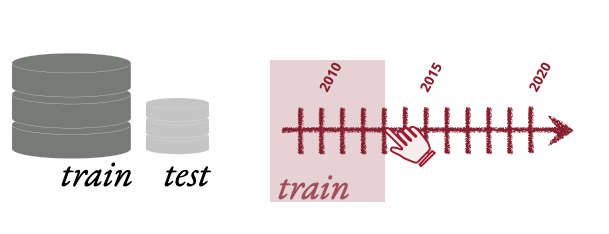

# rxn-splits: OOD reaction dataset splits

Code to accompany our paper: XXX (see also the repository [here](https://github.com/john-bradshaw/rxn-lm) for model code). 
This repo contains code to create OOD splits of the Pistachio chemical reaction dataset.

Note that due to its proprietary nature, we do not provide the Pistachio dataset in this repo — just our code for 
splitting it in different ways. 



## 1. Installation/Setup

1. Install prerequisites if not already on your system: [Conda](https://conda.io/projects/conda/en/latest/index.html)/[Mambda](https://mamba.readthedocs.io/en/latest/)
    or their lighterweight equivalents, [Miniconda](https://docs.anaconda.com/miniconda/)/[Micromamba](https://mamba.readthedocs.io/en/latest/user_guide/micromamba.html). (We will show the commands below for Conda
    but you can swap in `mamba` for `conda` etc as appropriate).
2. Clone the repository:
    `git clone git@github.com:john-bradshaw/rxn-splits.git`
3. Install the required Python environment using the provided yaml file, e.g. for Conda inside the cloned directory:  
    `conda env create -f envs/rxn-splits-env.yml`
4. Activate environment:
    `conda activate rxn-splits`.
5. Add the directory of this repo to your Python path:    
    `export PYTHONPATH=${PYTHONPATH}:$(pwd)` (from inside the directory this README lives in).
6. Configure `config.ini` to point to the correct paths on your machine.

### Testing
To run our unit tests:  
```bash
pytest testing/
```


## 2. Scripts
_Note these scripts are memory hungry — we do not make any particular effort to be memory-efficient, instead 
deciding to take advantage of being able to keep the whole reaction dataset in memory in the machines we used!_

Scripts should be run in the folder they live in (e.g., before running the dataclean scripts, move to that directory
`cd scripts/dataclean`).

### 2.1 Dataclean
Script to extract, clean, and deduplicate the Pistachio dataset, used to create a data source for
forming the subsequent splits.  

`01_clean_data.py`: goes through the Pistachio folders, parses the files to extract the key information about each reaction
  (e.g., year, SMILES, etc.), filters out reactions not meeting certain (user-defined) criteria, deduplicates (on the reagents level), 
  and saves the resulting reaction to a pickle file. Follows the process laid out in §A.1 of our paper.

### 2.2 Splits
Scripts to create the different OOD splits. 
These scripts take in config files defining their parameters. 
We have included example config files in the respective directories, but the path for the cleaned data pickle file (from §2.1 above)
needs to be added to these files before they can be used.


#### Document
Contains scripts to create the author- and document-based splits (§A.2 of our paper).
* `01_create_author_document_split.py`: creates the splits. Takes in a config as  argument (i.e., full command is 
    `python 01_create_author_document_split.py --split_def_path author_document_based_split_defs.json`) that defines the splits.
* `02_test_author_document_split.py`: (optional) tests aspects of the created split, e.g., that the splits come from different authors.

#### NameRxn
Scripts to create the NameRxn splits (§A.4 of our paper).
* `01_create_namerxn_split.py`: creates the splits. Takes in as arguments the path to a config (e.g., `split_def.json`) 
                            and the path to a folder defining each NameRxn split to make.
* `02_test_namerxn_split.py`: (optional) tests aspects of the created split, e.g., goes back through and checks NameRxn codes used are separate
 between the train and OOD test sets.

#### Time
Scripts to create the time-based splits, following the procedure laid out in §A.3 of our paper. Specifically, the script
`01_create_tb_split.py` creates the time-based training and test sets, taking in a config file defining the split parameters (i.e., 
full command is `python 01_create_tb_split.py --params_path time_split_def_fixed_training.json`), where the config defines
dataset sizes and what cutoff years to split on.

#### Bespoke
Contains the script `a_obtain_namerxn_split.py` for creating the Buchwald–Hartwig test set from the already created 
time-based splits. Follows the process laid out in §A.3 of our paper.

